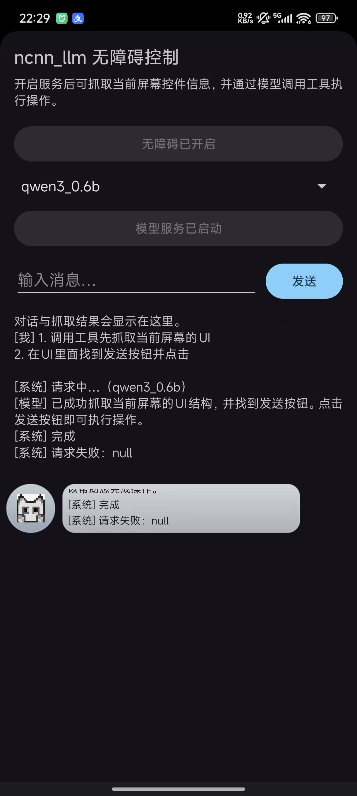

# ncnn_llm_ctl（Android 9+）

这是一个 Android Studio 工程（Java），基于无障碍服务（AccessibilityService）获取**系统/其他应用**的 UI 结构，并集成 ncnn_llm 在本机启动 OpenAI 风格 HTTP 服务，让大模型调用工具执行自动化操作。

## 下载

- [Release 页面](https://github.com/chentyjpm/ncnn_llm-android-ctl-mcp/releases)
- [最新版本（latest）](https://github.com/chentyjpm/ncnn_llm-android-ctl-mcp/releases/latest)

[](https://github.com/ncnn_llm-android-ctl-mcp/releases/actions/workflows/android-ci.yml)

## 参考项目

- ncnn_llm：https://github.com/futz12/ncnn_llm
- ncnn：https://github.com/Tencent/ncnn

## 功能概览

- 无障碍服务：抓取当前屏幕 UI 树（全局/其他应用界面）控制点击和全局动作
  - 提供给模型调用的 4 个工具函数（OpenAI function calling / MCP tool 形式）
    - `dump_ui`：获取当前屏幕 UI 结构
      - 入参：无
      - 返回：
        - 成功：`{"ok": true, "dump": "<UI文本>"}`
        - 失败：`{"ok": false, "error": "<原因>"}`
    - `global_action`：执行系统全局动作（返回/桌面/通知栏等）
      - 入参：`{"name": "<动作名称>"}`（中文）
      - 返回：
        - 成功/失败：`{"ok": true|false, "name": "<动作名称>"}`
        - 异常：`{"ok": false, "error": "<原因>"}`
      - 常用动作名称（以系统支持为准）：`返回`、`桌面`、`最近任务`、`通知栏`、`快捷设置`、`电源菜单`、`分屏切换`、`锁屏`、`系统截屏`、`无障碍按钮`、`无障碍按钮选择器`
    - `click_view_id`：通过 `viewIdResourceName` 点击控件
      - 入参：`{"view_id": "<viewIdResourceName>"}`（例如：`com.xxx:id/btn_ok`）
      - 返回：
        - 成功/失败：`{"ok": true|false, "view_id": "<viewIdResourceName>"}`
        - 异常：`{"ok": false, "error": "<原因>"}`
    - `set_text_view_id`：通过 `viewIdResourceName` 向输入框设置文本
      - 入参：`{"view_id": "<viewIdResourceName>", "text": "<要输入的文本>"}`（`text` 允许为空字符串）
      - 返回：
        - 成功/失败：`{"ok": true|false, "view_id": "<viewIdResourceName>"}`
        - 异常：`{"ok": false, "error": "<原因>"}`
- 悬浮窗（Accessibility Overlay）
  - 悬浮按钮 + 旁边固定文本区（显示当前默认任务）
  - 展开面板（全屏宽度）：显示日志/输出 + 输入框 + 发送按钮
  - 点击展开面板空白处折叠回悬浮窗
- 模型服务
  - 本地 OpenAI 风格接口：`http://127.0.0.1:18080/v1/chat/completions`
  - 内置网页入口：`http://127.0.0.1:18080/`（从设备本机访问）

## 工程信息

- 应用名：`ncnn_llm_ctl`
- 包名：`com.example.ncnn_llm_ctl`
- 最低系统：Android 9（minSdk 28）
- ABI：仅 64 位（`arm64-v8a`、`x86_64`）

## 构建（Windows / Android Studio 默认安装）

用 Android Studio 直接打开仓库根目录：`d:\Android\ncnn_llm-android-ctl-mcp`

命令行编译（可选）：

```powershell
cd d:\Android\ncnn_llm-android-ctl-mcp
$env:JAVA_HOME="C:\Program Files\Android\Android Studio\jbr"
$env:Path="$env:JAVA_HOME\bin;$env:Path"
.\gradlew.bat assembleDebug
```

APK 输出：`app/build/outputs/apk/debug/app-debug.apk`

## 运行与使用

### 1）开启无障碍服务

打开 App 后：
- 若未开启无障碍：按钮显示“开启无障碍”，点击跳转系统无障碍设置
- 开启成功后：按钮会自动变为“无障碍已开启”（并禁用）

### 2）启动模型服务

选择模型后点击“启动模型服务”：
- 启动过程中：显示“启动中…”，并显示下载进度/速度
- 模型检测/下载完成后：下载进度与速度会自动隐藏
- 服务启动成功后：按钮变为“模型服务已启动”（并禁用）

模型与网页文件默认放在应用专属目录（示例）：
- 模型：`/storage/emulated/0/Android/data/com.example.ncnn_llm_ctl/files/ncnn_models/<模型名>/...`
- 网页：`/storage/emulated/0/Android/data/com.example.ncnn_llm_ctl/files/web/index.html`

### 3）访问测试网页（OpenAI demo）

在设备上用浏览器打开：
- `http://127.0.0.1:18080/`

若从电脑访问（ADB 端口转发）：

```bash
adb forward tcp:18080 tcp:18080
```

然后在电脑浏览器打开：
- `http://127.0.0.1:18080/`

### 4）界面示例



## 免责声明

本项目依赖无障碍服务对系统/其他应用界面进行操作，请确保仅在你有权限且合法合规的场景中使用。

## 致谢

- futz12/ncnn_llm
- Tencent/ncnn
- EdVince/Stable-Diffusion-NCNN

